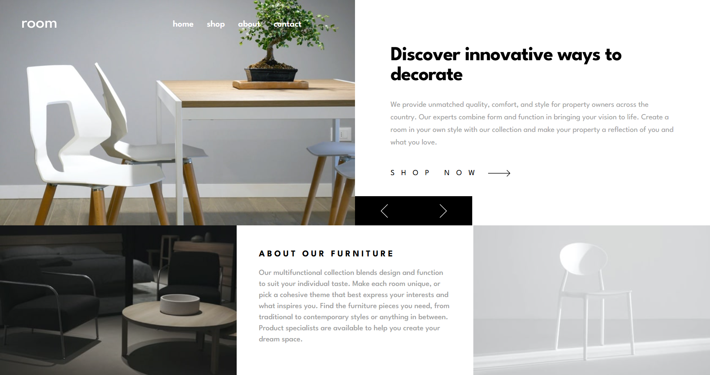

# Frontend Mentor - Room homepage solution

This is a solution to the [Room homepage challenge on Frontend Mentor](https://www.frontendmentor.io/challenges/room-homepage-BtdBY_ENq). Frontend Mentor challenges help you improve your coding skills by building realistic projects. 

## Table of contents

- [Overview](#overview)
  - [The challenge](#the-challenge)
  - [Screenshot](#screenshot)
  - [Links](#links)
- [My process](#my-process)
  - [Built with](#built-with)
  - [What I learned](#what-i-learned)
- [Author](#author)


## Overview

### The challenge

Users should be able to:

- View the optimal layout for the site depending on their device's screen size
- See hover states for all interactive elements on the page
- Navigate the slider using either their mouse/trackpad or keyboard

### Screenshot



### Links

- Solution URL: [room homepage master](https://github.com/abok-cymk/room-homepage-master)
- Live Site URL: [room homepage master](https://your-live-site-url.com)

## My process

### Built with

- Semantic HTML5 markup
- CSS custom properties
- Flexbox
- CSS Grid
- Mobile-first workflow
- [React](https://reactjs.org/) - JS library

### What I learned
I learned how to implement and use a carousel component in React, which allowed me to create an interactive slider for the homepage.

```
import { useEffect, useRef, useState } from "react";
import MobileNavigation from "./MobileNavigation";

export default function Navbar() {
  const [isMenuOpen, setIsMenuOpen] = useState(false);
  const menuRef = useRef(null);

  useEffect(() => {
    if (!isMenuOpen) return;

    const handleClickOutside = (event) => {
      if (menuRef.current && !menuRef.current.contains(event.target)) {
        setIsMenuOpen(false);
      }
    };

    document.addEventListener("mousedown", handleClickOutside);

    return () => {
      document.removeEventListener("mousedown", handleClickOutside);
    };
  }, [isMenuOpen]);

  return (
    // do something here
  );
};
```
### Continued development

- **Enhance accessibility:** Improve keyboard navigation, add ARIA attributes, and ensure the site is fully accessible to all users.
- **Add animations:** Implement smooth transitions and animations for the slider and navigation elements to enhance user experience.
- **Integrate a CMS:** Connect the project to a headless CMS to manage content dynamically.
- **Expand the slider:** Add support for more complex content types (e.g., video, interactive elements) within the carousel.
- **Improve testing:** Add unit and integration tests for components, especially the slider and navigation.
- **Optimize performance:** Lazy-load images and components, and further optimize for mobile devices.
- **Dark mode:** Add a dark mode toggle for improved usability and aesthetics.

## Author

- Frontend Mentor - [@abok-cymk](https://www.frontendmentor.io/profile/abok-cymk)
- Twitter - [@abokallan22](https://x.com/abokallan22)

